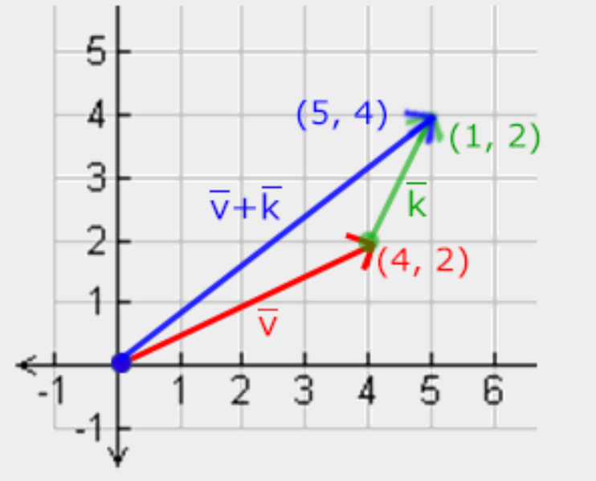
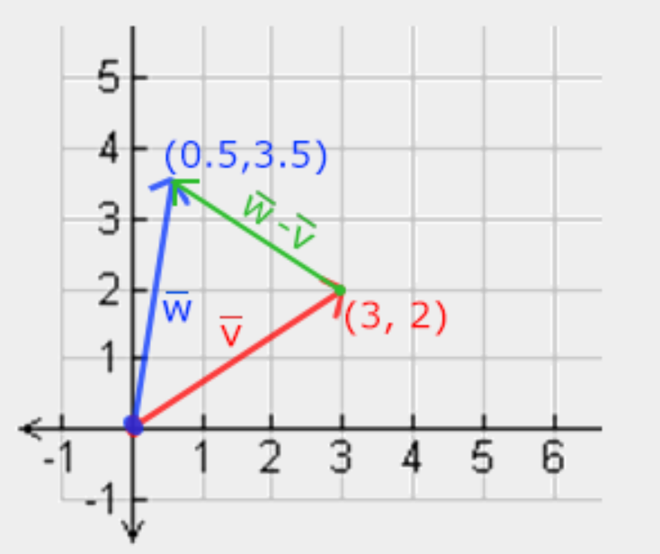
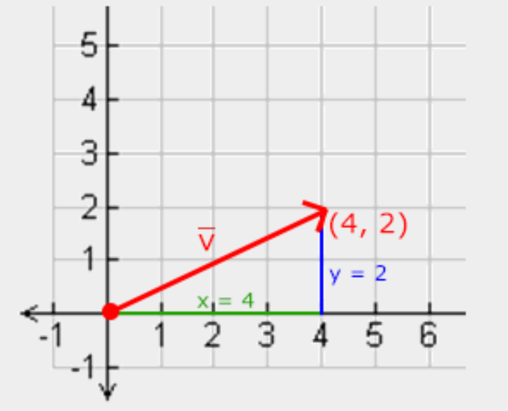

# 1. Transformations
## 1.1 How to move object 
- We can make objects move by changing their vertices and re-configuring their buffers  
each frame, but this is cumbersome and cost a lot.  
- There are much better ways to transform an object and that's using (multiple) matrix  
objects.  
## 1.2 Vectors
### 1.2.1 Vector definition
- A vector has a direction and a magnitude.  
- Vector mathematician description:  
$$\vec a = 
\begin{pmatrix}
x \\
y \\
z
\end{pmatrix}$$
- Vector can have any dimensions.  
### 1.2.2 Vector operations
#### 1.2.2.1 Scalar vector
- We can use $+,-,\times and \div$ to do scalar operation.  
$$
\begin{pmatrix}
1 \\
2 \\
3
\end{pmatrix} + x \to
\begin{pmatrix}
1 \\
2 \\
3
\end{pmatrix} +
\begin{pmatrix}
x \\
x \\
x
\end{pmatrix} = 
\begin{pmatrix}
1 + x \\
2 + x \\
3 + x
\end{pmatrix}
$$
- vector negative  
$$
-\vec v = - 
\begin{pmatrix}
   v_x  \\
    v_y \\
    v_z \\
\end{pmatrix} = 
\begin{pmatrix}
   -v_x  \\
    -v_y \\
    -v_z \\
\end{pmatrix}
$$
#### 1.2.2.2 Addition and subtraction
- The addition or subtraction with two vectors just add or sub their corresponding  
components, but in coordinate aspect, this is a operation which process two line and  
produce a new line.  
- Scalar aspect  
$$
\vec v = \begin{pmatrix}
   1  \\
    2 \\
    3 \\
\end{pmatrix}, \vec k = \begin{pmatrix}
    4 \\
    5 \\
    6 \\
\end{pmatrix} \to \vec v + \vec k = \begin{pmatrix}
    1 + 4 \\
    2 + 5 \\
    3 + 6 \\
\end{pmatrix} = \begin{pmatrix}
    5 \\
    7 \\
    9 \\
\end{pmatrix}
$$
- Coordinate aspect  

- Subtraction is similar with add.  

#### 1.2.2.3 Length
- The length/magnitude of vector is calculated with ${\color{Salmon}Pythagoras \ theorem}$  
- Scalar aspect  
$$
\vec v = \begin{pmatrix}
    x \\
    y \\
\end{pmatrix}, \  
\begin{Vmatrix}
    \vec v \\
\end{Vmatrix} = \sqrt{x^2 + y^2} $$
- Coordinate aspect  

- ${\color{ForestGreen}unit \ vector}$  
$$
\hat v = \frac{\vec v}{\begin{Vmatrix}
    \vec v \\
\end{Vmatrix}}  
$$
We call this ${\color{ForestGreen}normalizing}$ a vector.  
#### 1.2.2.4 Vector-vector multiplication
- There are two multiplication with vector-vector which are $\vec v \cdot \vec k$ called  
    dot product and $\vec v \times \vec k$ called cross product.  
##### 1.2.2.4.1 Dot product
- Dot product is a scalar value, there are two aspect to calculate it.  
- Coordinate aspect  
$$
\begin{pmatrix}
    0.6 \\
    -0.8 \\
    0 \\
\end{pmatrix} \cdot \begin{pmatrix}
    0 \\
    1 \\
    0 \\
\end{pmatrix} = (0.6 * 0) + (-0.8 * 1) + (0 * 0) = -0.8
$$
- Graphic aspect   
$$
\vec v \cdot \vec k = \begin{Vmatrix}
    \vec v \\
\end{Vmatrix} \cdot \begin{Vmatrix}
    \vec k \\
\end{Vmatrix} \cdot \cos \theta
$$
- This is an convenient approach to calculate angle between two line within   
Coordinate system.  
##### 1.2.2.4.2 Cross product
